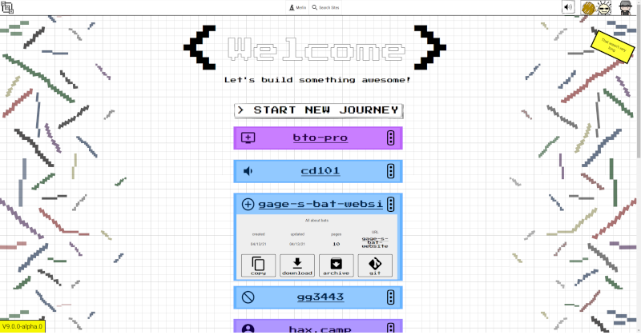

# HAX The Desktop
HAX The Desktop runs haxcms-nodejs and it's express based engine wrapped in electron.



Press `CommandOrControl+Shift+L` to show logs of whats happening in the 'app'

## How to run

```bash
npm install
npm start
```

## How to package for distribution

```bash
npm run pack
```